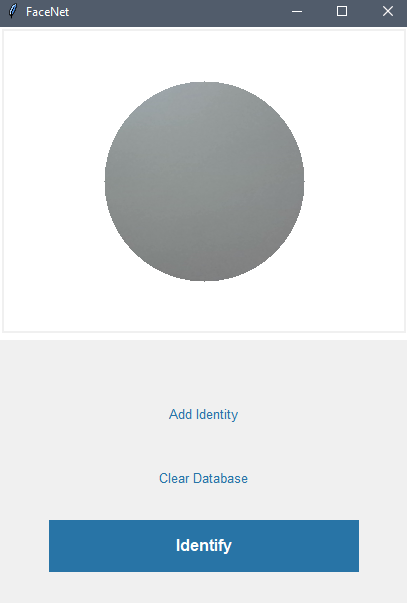

# FaceNet
An implementation of face recognition system using convolutional neural networks.
 
 
## Introduction
The implementation is inspired by the FaceNet paper [FaceNet: A Unified Embedding for Face Recognition and Clustering](https://arxiv.org/abs/1503.03832). The basic idea is to generate a numeric representation of the face called an embedding, and finding the shortest Euclidean distance between a test embedding and all the face embeddings registered in the database. If the shortest distance is less than the threshold, a match is detected.
 
 
## Image Pre-processing
OpenCV is used to detect facial area and eyes. Alignment is performed by align function in [aligner.py](aligner.py). The preprocessed image is passed through the neural network to generate a face embedding.
 
 
## Model
A pretrained model was used from [Skuldur/facenet-face-recognition](https://github.com/Skuldur/facenet-face-recognition). The model is saved using keras (version 2.1.6). Later versions might not be compatible with tensorflow-gpu.
 
 
## Detection
In this implementation, only one image(embedding) per person is stored in database. An optional linear SVM classifier maybe used if initially multiple images are recorded in database. 
 
 

 
## GUI
GUI was made with Tkinter. Webcam is the source of imagery in this implementation. OpenCV is used to access the webcam and capture the image.
 
 
